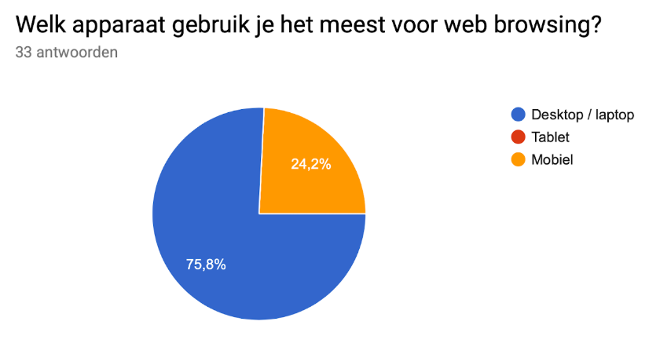
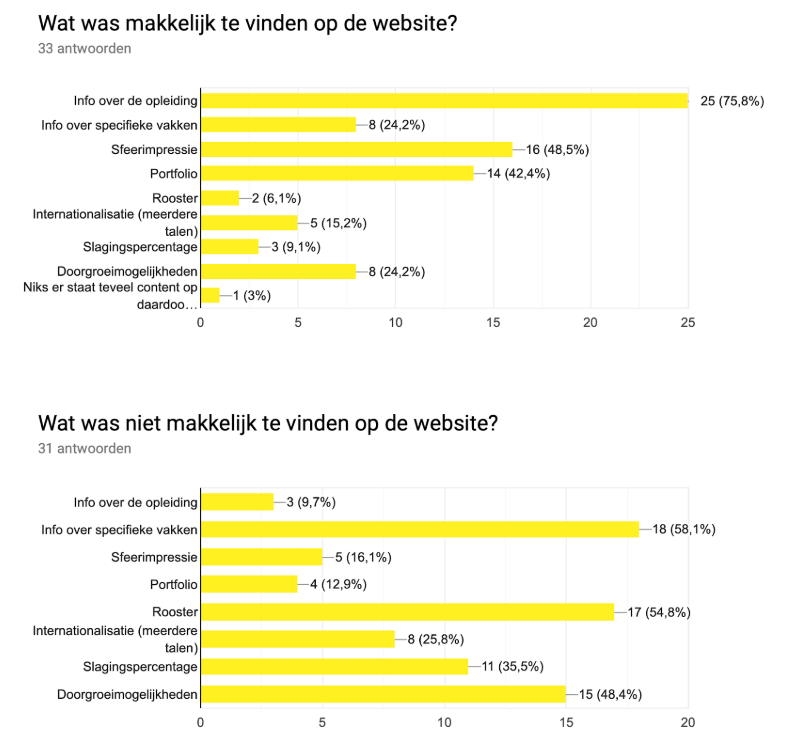
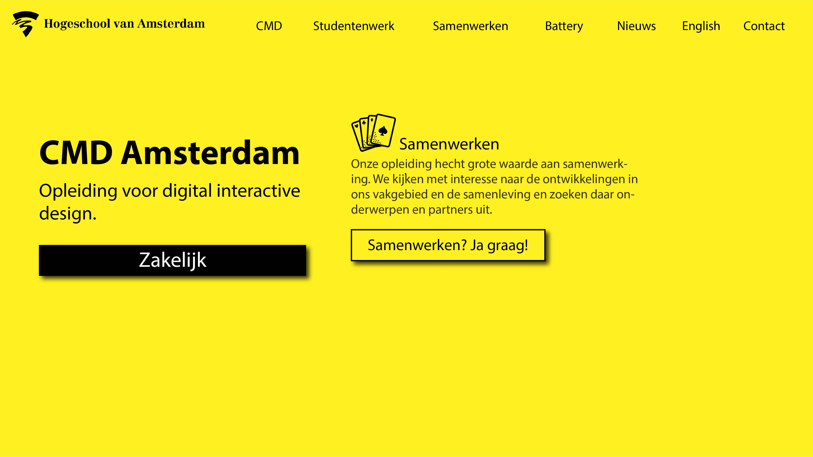
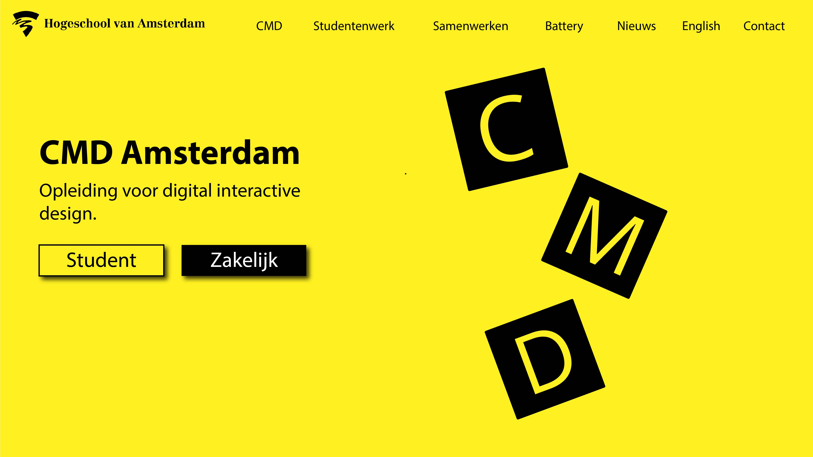
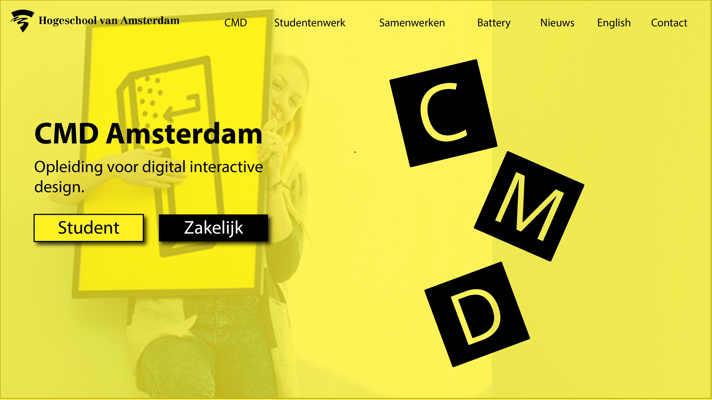
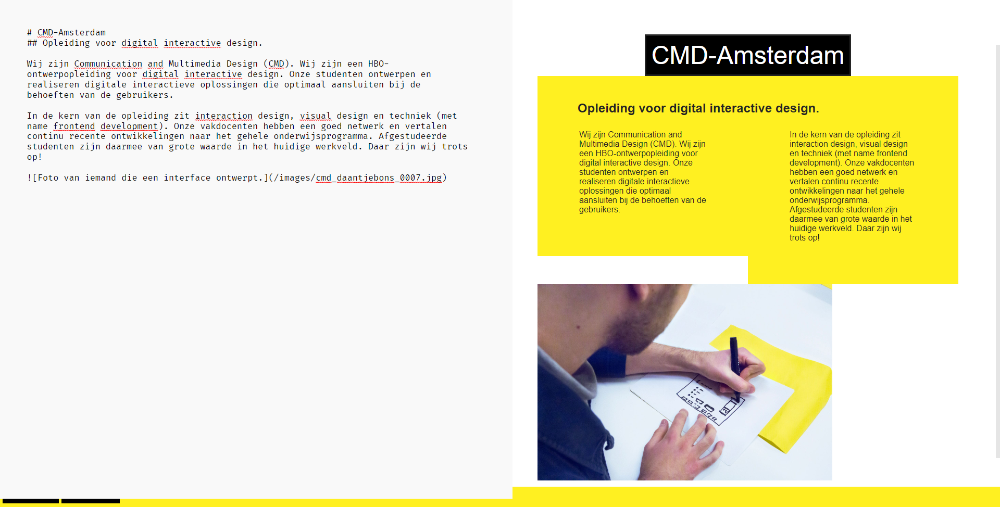
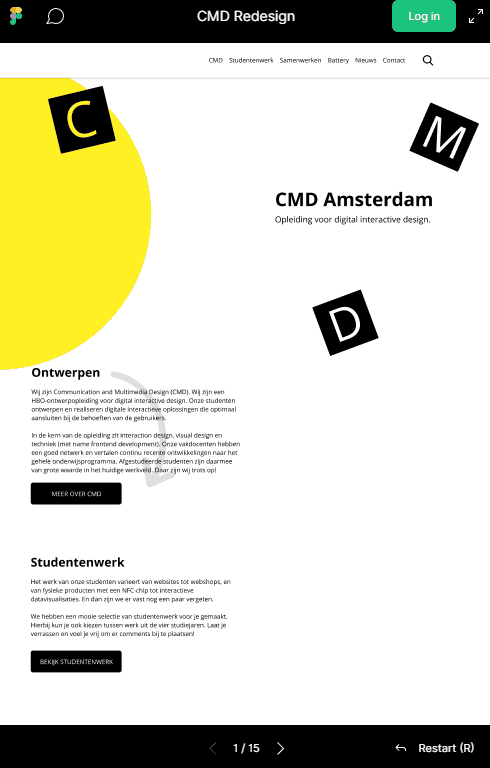

# Meesterproef 2019 @cmda-minor-web · 2018-2019

 
 

 
 
 

## Glossary

	
Click here to expand

- [Meesterproef 2019 @cmda-minor-web · 2018-2019](#Meesterproef-2019-cmda-minor-web--2018-2019)
	- [Glossary](#Glossary)
		- [Introduction](#Introduction)
		- [Primary Goals](#Primary-Goals)
		- [Design Rationale](#Design-Rationale)
		- [Coolest features](#Coolest-features)
		- [Product Biography](#Product-Biography)
			- [Week 1](#Week-1)
			- [Week 2](#Week-2)
			- [Week 3](#Week-3)
			- [Week 4](#Week-4)
			- [Week 5](#Week-5)
		- [Personal Reflection](#Personal-Reflection)
	- [Feedback](#Feedback)
		- [Wednesday 12-06-2019 - Joost](#Wednesday-12-06-2019---Joost)
		- [Tuesday 18-06-2019 - Vasilis](#Tuesday-18-06-2019---Vasilis)
		- [Friday 21-06-2019 - Joost](#Friday-21-06-2019---Joost)
		- [Tuesday 25-06-2019 - Vasilis](#Tuesday-25-06-2019---Vasilis)
	- [General](#General)
	- [Personal goals](#Personal-goals)

 
 
 

### Introduction
This is my personal documentation repository for [the "_meesterproef_"](https://github.com/cmda-minor-web/meesterproef-1819).

Together with my team members Karin and Tjebbe, we figured out how to effectively work together on a GIT project, and how to delegate everyone's task accordingly throughout this mental exercise.

Our project focuses on the improvement of [the current CMD-website](https://cmd-amsterdam.nl). The website takes ages to load, is very large bytewise, is not optimally accessible and relies on a Wordpress theme that brings a lot of other problems with it. To untangle this bowl of spaghetti, we set out to improve all of the aforementioned issues.

 
 
 

### Primary Goals
We had a few primary goals we wanted to achieve throughout the _meesterproef_. Here is that list of goals, with their translation to classes taught in the minor web development (click a goal to view it in detail):

	
✔️ <b>Improve design visually</b>

  - [Web Design](https://github.com/cmda-minor-web/web-design-1819): Exclusive design
  - [Browser Technologies](https://github.com/cmda-minor-web/browser-technologies-1819): Progressive enhancement
  - [Css to The Rescue](https://github.com/cmda-minor-web/css-to-the-rescue-1819): Accessibility

 

	
✔️ <b>Improve design performance-wise</b>

  - [Performance Matters](https://github.com/cmda-minor-web/performance-matters-1819): Server-size rendering, lazyloading, optimised critical render path
  - [Web App From Scratch](https://github.com/cmda-minor-web/web-app-from-scratch-1819): No unnecessary libraries and frameworks  

 

	
✔️ <b>Improve the overal speed (loading, time to interactive, <abbr lang="la" title="et cetera">etc</abbr>.)</b>

  - Same subgoals as above

 

	
✔️ <b>Decrease unresponsiveness</b>

  - Same subgoals as above

 

	
✔️ <b>Decrease download size</b>

  - [Performance Matters](https://github.com/cmda-minor-web/performance-matters-1819): Compression middleware

 

	
✔️ <b>Allow offline interaction</b>

  - [Performance Matters](https://github.com/cmda-minor-web/performance-matters-1819): Going offline

 

	
✔️ <b>Keep the same functionality for users and authors/administrators</b>

  - [Web Design](https://github.com/cmda-minor-web/web-design-1819): Exclusive design

 

	
✔️ <b>Make it the best damn website for any disabled student/person ever. Period.</b> (My personal goal, hence the enthousiasm)

  - [Web Design](https://github.com/cmda-minor-web/web-design-1819): Exclusive design
    - I wanted to learn more about what accessibility really is, and how to apply it
    - I wanted to make people happy while using this website
  - [Css to The Rescue](https://github.com/cmda-minor-web/css-to-the-rescue-1819): Accessibility
    - I wanted to make the visual animations accessible to blind people
    - I wanted to liven up the commonly boring sound of a screenreader
    - I wanted to stay away from javascript for accessibility enhancements (pure HTML/css)

 

Hopefully, you will notice the great care I put into even making this document as accessible as I can through Github's markdown.

 
 
 

### Design Rationale
[View our design rationale on Google Docs](https://docs.google.com/document/d/1toyN4tPRlzsABDbuHqO_YPZbvK05ryDJZNUmT_EPXms/edit?usp=sharing).

 
 
 

### Coolest features
afdghdfgsdfgsdf

 
 
 

### Product Biography

	
Click here to expand the biography

#### Week 1
The first week we took the time to get to know our client, and the website we were tasked to improve.

We understood that our client, whom I shall hereafter refer to as Mattijs, knew there were problems with the site, but he did not know any exact issues. To give him and ourselves an idea of the core problems we set out to do some research: How fast is the website? How accessible is the website? How does the website look?

**How fast is the website?** 
From the performance research we did, we concluded that the page loaded fine on fast and unlimited networks, but as soon as you loaded it on a phone or other portable medium, the scores went down the drain. To zoom in on why that happens: the average load time for phones on 3g is approximately ten seconds. The website is composed of about four million bytes (that is about 4 mb, or two and a half floppy disks 💾), and the average 3g download speed is 6 mb/s. It takes almost a second to download the page (under the *ultimate* **greatest** and ***best*** conditions), and then it must still be parsed. The bad thing about those bytes, is that about 85% of them are not used. 3.4 million unused bytes... geez. So not only are those unused bytes downloaded, they have to be parsed too; all in all, this process took about **21**(!!!) seconds. We had found out why the page was such a 🐌.

**How accessible is the website?** 
When running some quick adits, we discovered the website scores about 81% in Google's Lighthouse audits. 81 out of a hundred points might sound like a lot, but it really is not once you learn that you can easily score 100%. We quickly found the main culprits: page zoom 🔍 was disabled for some reason, so people that have trouble reading are screwed. Also, some links had no discernible name, which in layman's terms means a screenreader (or other programmes such as Googlebot 🤖, Google's webcrawler) cannot understand what that link is. does it navigate to a sub-page? Does it direct us to a Twitter account? Who knows! Other small things were lacking heading structure, unfocusable interactive elements and the infamous _div-soup_.

**How does the website look?** 
We had a look around websites of other schools that provide similar education to CMD. The best parts of the CMD website were its easy scannability and a fairly strong application of the CMD-identity. Most competing schools contain giant lists 📰 of information and bulletpoints on why that specific school is the best. Most websites did not even pass basic accessibility tests such as proper contrast, but then again, the CMD website did not pass every test either.

#### Week 2
This week we presented our findings to Mattijs. It was very enlightening for all of us to get a proper summary of everything that was right and wrong and what could and should be fixed.

A short summary for you, to understand our newfound tasks:
- Account for mobile use
- Better application of the CMD-identity
- Highlight student work instead of boring text
- Tell users why CMD is the best education (in short)
- Make clear what sets CMD apart from other schools
- Improve load times by at least 80% (should load in less than 5 seconds), ideally far less
- Think of a solution to Wordpress' incessant worsening of markup quality
- Mattijs (or other editors) must be able to still use our new solution without much in-depth knowledge

We presented our findings and research to Mattijs, and he expressed gratitude for the clear summary. We agreed to start designing and present the first preliminary iteration the following week, along with other research regarding common user-goals, according to real users of the website.

We asked what medium people used to browse the website:

We also asked what people found easy and hard to find (sorry, it is in Dutch):

#### Week 3
The results we got throughout the week before allowed us to design our first prototypes. Here are some of the nine sketches:

Our designer got a bad rep this week, because the designs were not quite what Mattijs was expecting, nor what he had envisioned a CMD-website would look like. He expressed concerns regarding the CMd-identity. He said we had strayed too far from the styleguides, and I agreed completely. Even though I had decided to focus only on accessibility (to leave room for the learning of others), I meedled a bit with the new design, making sure we went back to our true CMD-identity. The results of that will be shown in the summary of week 4.

We were still thinking about a solution to the problem of the <abbr lang="en" title="Content Management System">CMS</abbr>, but we had a brilliant idea: we have been writing easy HTML documents for years now, with a little help of Markdown. All modern editors nowadays support some dialect of HTML to make it easier and quicker to write; why not use this for our solution. too?

We got to programming and quickly devised a prototype:

The left textbox is for markdown, and the right box is a live-rendered preview of a fully parsed an semantically correct HTML-document. Perfect! That is exactly what we needed:
- No styling in markup
- Easy to write and edit for people who do not know HTML (and easy to learn)
- Maintain the way the Wordpress website would currently be edited
- Easily port Wordpress data to our new datamodel

We wanted to integrate [Microsoft's Monaco Editor](https://microsoft.github.io/monaco-editor/), but this proved difficult for us because of a lack of experience. This editor would provide amazing features such as syntax highlighting, autocompletion, diff-checking and much more! If other people take up the project after us, I highly recommend this step.

Because of the simplicity of our self-made editor, there was no way to show revisions within documents, and no easy way to see if your code was valid because of the lack of syntax highlighting, though it was a good proof of concept.

JUSTJS

#### Week 4
Another week, another design iteration.

 
 

We showed the designs to Mattijs, who was visibly more happy with the new designs than last week, but there was still some discrepancy between the designs and the CMD-styleguide. A couple of the points that were not quite right:
- The styleguide disallows any rounded corners
- There are not really any grey values used in the styleguide
- There are lots of CMD icons, but we used none

Apart from those points, we were on the right track!

We set up a database, saved pages and articles in that database and setup a basic save/discard changes system. Things were looking good!

When we showed our progress to our coach, we got bad news. He was "underwhelmed". All we had showed him was a design in some image editing programme -- that is far from a working prototype, he made clear. We walked away after the meeting feeling pretty down; that is not good feedback to recieve.

It turns out, we were just not properly communicating what we had done up to that point, because the design was already fully worked out in CSS, and was live on the website. The entire story about databases and editors and other technical things did not much bother our coach, understandibly so, because that was not his expertise. We had wrongly read the situation -- one of the recurring points I reflect on later. We came to the conclusion that were *were* on the right track, but were not properly telling the exciting parts to the correct people. You would not tell a designer about programming just as much as you would not bother a programmer with design problems (unless they are CMD'ers ofcourse).

This week I could finally implement proper accessibility, because most enhancements were design-bound. Images were added and removed all the time, so things as proper alt-attributes had to wait for a final product.

Every image that mattered now had a descriptive alt-attribute, along with some funny bits of text to entertain less able-bodied users of our website. This gave me great satisfaction, because I personally think the internet should be usable by everyone. I got some extra tips for even better accessibility, such as `<abbr>` attributes for abbreviations (which I have cleverly used throughout this document as well, did you spot them? 😉), and adding proper `lang` attributes.

#### Week 5
The final week had begun, and we were pretty confident at this point, because the entire website and backend were basically done. Some minor (and, to be honest, major) bugs had to be fixed, but that proved to not be a hard task.

We had another meeting with our coach, but this time we prepared what to say and what to show. We had barely altered the website from the previous meeting, but this time he seemed filled with joy at the sight -- and sound -- of our prototype. We knew what to tell and show him instead of boring technical stuff. He confirmed it, we were doing good. Now that is great feedback!

After that, I began writing this very README, how _meta_.

---

 
 
 

### Personal Reflection

	
Click here to expand the reflection

## Feedback
### Wednesday 12-06-2019 - Joost
At this point in time, we were not sure how to exactly present what we were going to deliver at the end of the meesterproef. Joost helped us clearly document to ourselves and Mattijs what we were going to deliver.

This feedback was very helpful because we lacked a clear direction within our group, which was a reoccurring propblem. He helped me get straight what I wanted to get done and what would have been nice to have, or flat out unnecessary.

### Tuesday 18-06-2019 - Vasilis
Vasilis was "underwhelmed" by what we delivered. We tried very hard to make it *overwhelming* for when we would next speak.

I think this was mainly because we did not properly tell him the things that he might have found exciting. We mostly told boring technical stuff thinking he would be as excited as we were of our accomplishments. I had a long think afterwards, because that really is devastating feedback. I came to the conclusion that we were on the right track, we just had to explain ourselves better. I felt like I was the one mostly in charge of speaking for our group, so I took it as my responsibility.

### Friday 21-06-2019 - Joost
I had this feedback session after one of my groupmembers did. Joost had told them that he was disappointed by the work we had presented. Again, devastating -- and there seemed to be a pattern. Whenever I was not there to talk about the features, we got negative feedback.

I was next, so I had a bit of a talk with Joost. He was happily surprised that we had done much more than he was led to believe. I absolutely do not mean to negatively speak about my teammembers, because they did a lot of valuable work; they could however work a bit on their assertiveness. This was one of the reasons I decided to write [this article on the Impostor Syndrome and assertiveness in the Webdesign Industry](https://medium.com/@maanlampje/i-am-not-a-real-programmer-ae46f70934ce?source=friends_link&sk=abbc5fa36b29bdb24eb00e3150c84efa).

### Tuesday 25-06-2019 - Vasilis
This was the last time we saw Vasilis before the deadline. We had tried to implement some features that he could properly give feedback on, and that would hopefully excite him. We had succeeded, because he seemed geniunely happy during and after our short presentation of our work. Even though we had not changed much since last time we saw him, he was overwhelmingly more positive; my previous assumptions on why we were getting such negative feedback were correct.

## General
So it turns out we had problems explaining ourselves to our coaches and client; this might have been the biggest learning point for me.

I also learned a great deal by speaking to our client, Mattijs. Untill now, we had only ever delivered projects to our teachers, and simple single-week-development projects for other clients. It was a bit of an eye-opener to go through that process. We forgot to prepare a presentation the first time we were going to *present* our research. That was a bit of a whoopsie. I also learned a lot about how to manage the expectations of a client, meaning that it is important to tell them what I can and cannot do within the time we were given.

## Personal goals

**I wanted to learn more about what accessibility really is, and how to apply it** 
I read up on accessibilty. I read many articles on what accessibility is, why it is important and how to apply accessibility all sorts of ways. [Articles such as this one, that taught me a lot of things about the `aria-label` attribute](https://developer.mozilla.org/en-US/docs/Web/Accessibility/ARIA/ARIA_Techniques/Using_the_aria-label_attribute), or [this article that taught me ***everything*** about the `<abbr>` tag](https://alistapart.com/article/hattrick/).

I think this applies to *understanding and conforming to your users needs*. I had not written a user scenario because there was no particular singular user. We did, however, do research on the actual target audience of the site, and mapped their needs. In my opinion, I used our findings and the articles I read to meet the user needs.

I applied Vasilis' Exclusive Design principles to get there: **I studied the situation**. We dedicated a full week and some more days to research. **I ignored conventions**. Many sites tell you that the `alt`-attribute is just a place where you must very briefly explain the content of an image. I decided no, I want to tell *exactly* what the content is, and make the screenreaders react to it. **I prioritised identity**. One of the primary goals of Mattijs was to recapture the CMD-identity that got lost through the Wordpress-theme. I extrapolated this identity into the way the screenreader speaks to you. We try to be creative in solving problems, and I tried to be creative in telling the computer what the content of an image is. **I added nonsense.** Our visual designer had added vibrating, rotating and fading icons, but a blind or otherwise visually impaired user could not enjoy them as I do. I decided to audibly describe the animations, using a bit of tongue and cheek humour throughout them.

**I wanted to make people happy while using this website** 
I think by applying the Exclusive Design principles I can make people laugh that otherwise would have had a harrowing experience. I often made myself, classmates and Vasilis laugh at my descriptions of images, which gives me the feeling I am on the right track. I sadly do not know anyone who is blind or otherwise visually impaired, so I could not test it personally.

**I wanted to make the visual animations accessible to blind people** 
I explained this previously. Why would only people that can see enjoy animations?

**I wanted to liven up the commonly boring sound of a screenreader** 
I not only added expressive alt-descriptions of images, I also tried to have the screenreader act as if it would react to those images. I did some personal research on what strings and characters worked to make the sounds I wanted the screenreader to make. Some funny combinations are:
- "wieweweweww" is pronounced as "Wawewiewewo"
- "hiyon hiyon hiyon hiyon" is prounounced as you read it, [but it sounds like this guy](https://www.youtube.com/watch?v=hRH1tYD6bow).
- "aaah hèèèèè hè hè hèh hèèèèè hè" [reminds me vagely of this guy](https://youtu.be/eVFd46qABi0?t=5).

If you want to listen to what these would sound like, try google translator's "listen" feature, or install a screenreader.

**I wanted to stay away from javascript for accessibility enhancements (pure HTML/css)** 
Not a single word of JS was written to enable a very accessible new homepage.

